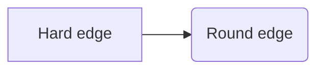
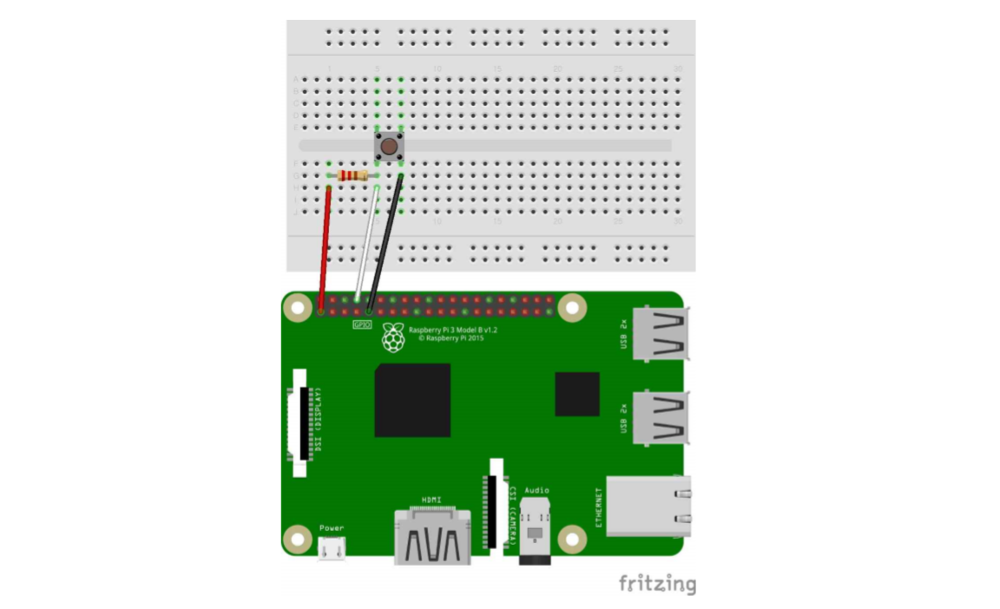
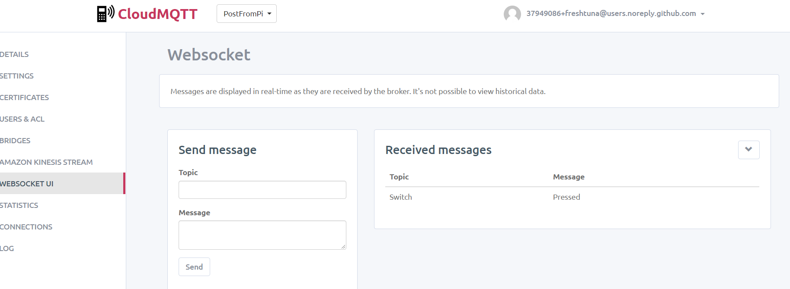

# Raspberrypi-mqtt-message
First step for my project making a locker functions with an application.    

I used Cloudmqtt for posting messages.     
Sends message pressed every time I press the switch connected to my Raspberry pi
### Circuit Structure

`import paho.mqtt.client as mqtt`

